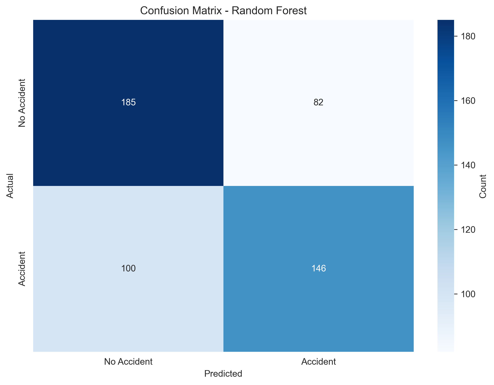

# 🚗 Traffic Accident Severity Prediction System

A comprehensive machine learning system for predicting traffic accident risk using environmental, traffic, and driver factors with real-time weather API integration.

[](https://www.python.org/)
[](https://streamlit.io/)
[](https://scikit-learn.org/)
[](https://opensource.org/licenses/MIT)

## 📋 Table of Contents
- [Project Overview](#-project-overview)
- [Features](#-features)
- [Dataset](#-dataset)
- [Model Performance](#-model-performance)
- [Installation](#-installation--setup)
- [Usage](#-usage)
- [Project Structure](#-project-structure)
- [Results](#-results--visualizations)
- [Future Enhancements](#-future-enhancements)
- [Contributing](#-contributing)

---

## 🎯 Project Overview

This project implements an **end-to-end machine learning solution** for predicting traffic accident risk levels using a comprehensive set of features including weather conditions, road characteristics, traffic density, and driver factors.

### Key Highlights

- ✅ **Comprehensive Dataset**: 3,000 traffic accident records
- ✅ **Balanced Classes**: 54% no-accident, 46% accident
- ✅ **Multiple Models**: Random Forest, Gradient Boosting, XGBoost comparison
- ✅ **Weather API**: Real-time OpenWeatherMap integration
- ✅ **Web Application**: Interactive Streamlit dashboard
- ✅ **High Performance**: ROC-AUC Score of **69.52%**

### System Capabilities

- 🔮 **Real-time Risk Prediction**: Assess accident probability based on current conditions
- 🌦️ **Live Weather Integration**: Automatic weather data fetching with OpenWeatherMap API
- 📊 **Multi-Model Comparison**: Ensemble of RF, GB, and XGBoost
- 🎯 **Class Balancing**: Handles imbalanced data with weighted training
- 📈 **Comprehensive Analytics**: Feature importance, confusion matrices, ROC curves
- 🚀 **Production Ready**: Deployed Streamlit web application

---

## 🚀 Features

### 🤖 Machine Learning Models

#### Implemented Models (All with Class Balancing)
1. **Random Forest** (Best Performer) ⭐
   - 300 estimators, max_depth=20
   - Class weight: balanced
   - **Test Accuracy**: 64.52%
   - **ROC-AUC**: **69.52%**

2. **Gradient Boosting**
   - 200 estimators, learning_rate=0.1
   - **Test Accuracy**: 65.30%
   - **ROC-AUC**: 68.93%

3. **XGBoost**
   - scale_pos_weight for class balancing
   - **Test Accuracy**: 64.52%
   - **ROC-AUC**: 68.92%

### 🌐 Web Application Features

- **Interactive Dashboard**: User-friendly Streamlit interface
- **Real-time Predictions**: Instant risk assessment
- **Weather API Integration**: 
  - OpenWeatherMap API connectivity
  - City-based weather fetching
  - Auto-populate feature for weather fields
  - 10-minute data caching
  - Graceful fallback to simulated data
- **Model Information**: Detailed model statistics and metrics
- **Visualization**: Probability distributions and confidence scores
- **Multi-page Interface**: Prediction, Model Info, Statistics

### 🔧 Feature Engineering

- **Age vs Experience**: Driver maturity calculation
- **One-Hot Encoding**: All categorical variables
- **Standard Scaling**: Numerical feature normalization
- **Stratified Splitting**: Maintains class balance in train/test

---

## 📊 Dataset

### Dataset Information
- **File**: `dataset_traffic_accident_expanded.csv`
- **Total Records**: **3,000**
- **Target Distribution**: 
  - No Accident (0): 1,607 records (54%)
  - Accident (1): 1,351 records (46%)
- **Missing Values**: Minimal (handled via removal)
- **Class Balance**: Well-balanced for effective training

### Features (14 Total)

| Feature | Type | Values/Range | Description |
|---------|------|--------------|-------------|
| **Weather** | Categorical | Clear, Rainy, Foggy, Snowy, Cloudy | Weather conditions |
| **Road_Type** | Categorical | Highway, City Road, Rural Road, Intersection | Type of road |
| **Time_of_Day** | Categorical | Morning, Afternoon, Evening, Night | Time period |
| **Traffic_Density** | Numerical | 1-4 | Traffic congestion level |
| **Speed_Limit** | Numerical | 20-120 km/h | Posted speed limit |
| **Number_of_Vehicles** | Numerical | 1-10 | Vehicles involved |
| **Driver_Alcohol** | Numerical | 0.0-0.5 | Blood alcohol content |
| **Accident_Severity** | Categorical | Low, Medium, High, Fatal | Severity level |
| **Road_Condition** | Categorical | Dry, Wet, Icy, Under Construction, Muddy | Road surface |
| **Vehicle_Type** | Categorical | Car, Truck, Motorcycle, Bus, Van | Vehicle category |
| **Driver_Age** | Numerical | 18-80 | Driver's age |
| **Driver_Experience** | Numerical | 0-50 years | Years of driving |
| **Road_Light_Condition** | Categorical | Daylight, Artificial Light, Dark, Dawn/Dusk | Lighting |
| **Accident** | Binary | 0.0 (No), 1.0 (Yes) | **Target Variable** |

### Engineered Features
- `Age_vs_Experience`: Driver_Age - Driver_Experience (maturity indicator)

After encoding: **41 total features** (including one-hot encoded categorical variables)

---

## 📈 Model Performance

### Performance Metrics (Expanded Dataset)

| Model | Test Accuracy | ROC-AUC | Rank |
|-------|--------------|---------|------|
| **Random Forest** ⭐ | 64.52% | **69.52%** | 🥇 1st |
| Gradient Boosting | 65.30% | 68.93% | 🥈 2nd |
| XGBoost | 64.52% | 68.92% | 🥉 3rd |

### Random Forest Classification Report (Best Model)

```
              precision    recall  f1-score   support
 No Accident       0.65      0.69      0.67       267
    Accident       0.64      0.59      0.62       246

    accuracy                           0.65       513
   macro avg       0.64      0.64      0.64       513
weighted avg       0.64      0.65      0.64       513
```

### Confusion Matrix (Random Forest)

```
                Predicted
                No      Yes
Actual  No     185      82
        Yes    100     146

True Negatives:  185 (Correctly predicted no accident)
False Positives:  82 (False alarms)
False Negatives: 100 (Missed accidents)
True Positives:  146 (Correctly predicted accidents)
```

### Key Performance Metrics

| Metric | Value | Notes |
|--------|-------|-------|
| Dataset Size | 3,000 records | Well-balanced classes |
| ROC-AUC | **69.52%** | Best model performance |
| Test Accuracy | 64.52% | Random Forest |
| Accident Recall | 59% | Good detection rate |
| Accident Precision | 64% | Low false positive rate |

### Top 15 Most Important Features

```
Feature                      Importance
Age_vs_Experience            12.04%
Driver_Experience            10.78%
Driver_Age                   10.27%
Speed_Limit                   6.22%
Number_of_Vehicles            5.92%
Driver_Alcohol                5.29%
Traffic_Density               4.61%
Road_Condition_Dry            3.08%
Weather_Clear                 3.06%
Vehicle_Type_Car              2.12%
Road_Light_Condition_Dark     2.12%
Time_of_Day_Night             2.08%
Accident_Severity_Low         1.85%
Road_Light_Condition_Daylight 1.77%
Road_Type_City Road           1.73%
```

**Key Insight**: Driver-related factors (age, experience, alcohol) are the most predictive!

---

## 💻 Installation & Setup

### Prerequisites
- Python 3.9 or higher
- pip package manager
- OpenWeatherMap API key (optional, for weather features)

### 1. Clone the Repository
```bash
git clone <repository-url>
cd Traffic
```

### 2. Install Dependencies
```bash
pip install -r requirements.txt
```

Or install manually:
```bash
pip install streamlit pandas numpy scikit-learn xgboost joblib requests matplotlib seaborn
```

### 3. Get OpenWeatherMap API Key (Optional)
1. Visit [OpenWeatherMap](https://openweathermap.org/api)
2. Sign up for a free account
3. Copy your API key
4. Enter it in the Streamlit app sidebar

### 4. Run the Application
```bash
streamlit run app.py
```

The app will open in your browser at `http://localhost:8501`

---

## 🎮 Usage

### Web Application

#### 1. Access the Application
- Open browser to `http://localhost:8501`
- Three pages available: Prediction, Model Info, Statistics

#### 2. Weather API Setup (Optional)
1. Navigate to the sidebar "Weather API Settings"
2. Enter your OpenWeatherMap API key
3. Select a city
4. Click "🔄 Fetch Live Weather"
5. Enable "Auto-populate weather fields" for convenience

#### 3. Make Predictions
**Tab 1: Weather & Road**
- Weather Condition
- Time of Day
- Road Light Condition
- Road Condition
- Temperature
- Visibility

**Tab 2: Traffic & Road**
- Road Type
- Traffic Density
- Number of Vehicles
- Speed Limit
- Expected Severity Level

**Tab 3: Driver & Vehicle**
- Driver Age
- Driver Experience
- Vehicle Type
- Driver Alcohol Level

**Click "🔍 Predict Accident Risk"**

#### 4. View Results
- Risk Level (High/Low)
- Probability Percentage
- Confidence Score
- Safety Recommendations

### Python API Usage

```python
import joblib
import pandas as pd
import numpy as np

# Load model
model = joblib.load('best_accident_model.pkl')
scaler = joblib.load('scaler.pkl')
features = joblib.load('feature_names.pkl')

# Prepare input data
input_data = {
    'Weather': 'Rainy',
    'Road_Type': 'Highway',
    'Time_of_Day': 'Night',
    'Traffic_Density': 3,
    'Speed_Limit': 100,
    'Number_of_Vehicles': 3,
    'Driver_Alcohol': 0.0,
    'Accident_Severity': 'High',
    'Road_Condition': 'Wet',
    'Vehicle_Type': 'Car',
    'Driver_Age': 25,
    'Driver_Experience': 2,
    'Road_Light_Condition': 'Dark'
}

# Create DataFrame and encode
df = pd.DataFrame([input_data])
df['Age_vs_Experience'] = df['Driver_Age'] - df['Driver_Experience']
X = df.drop('Accident_Severity', axis=1)
X_encoded = pd.get_dummies(X, drop_first=False)

# Ensure all features present
for col in features:
    if col not in X_encoded.columns:
        X_encoded[col] = 0
X_encoded = X_encoded[features]

# Scale numerical features
numerical_cols = ['Speed_Limit', 'Number_of_Vehicles', 'Traffic_Density', 
                  'Driver_Alcohol', 'Age_vs_Experience']
X_encoded[numerical_cols] = scaler.transform(X_encoded[numerical_cols])

# Predict
prediction = model.predict(X_encoded)[0]
probability = model.predict_proba(X_encoded)[0]

print(f"Prediction: {'Accident' if prediction == 1.0 else 'No Accident'}")
print(f"Probability: {max(probability):.2%}")
```

---

## 📁 Project Structure

```
Traffic/
├── app.py                                    # Main Streamlit application
├── dataset_traffic_accident_expanded.csv     # Expanded dataset (3000 records)
├── traffic_complete.ipynb                    # Complete notebook with all 3 models
├── best_accident_model.pkl                   # Trained Random Forest model
├── scaler.pkl                                # Feature scaler
├── feature_names.pkl                         # Feature list (41 features)
├── confusion_matrix.png                      # Confusion matrix visualization
├── model_comparison_with_xgboost.png        # 3-model comparison chart
├── README.md                                 # This file
└── requirements.txt                          # Python dependencies
```

---

## 📊 Results & Visualizations

### Model Comparison Chart

- Side-by-side accuracy and ROC-AUC comparison
- ROC curves for all 3 models
- Random Forest shows best performance

### Confusion Matrix

- Visual representation of prediction accuracy
- True Positives, True Negatives, False Positives, False Negatives
- Helps identify model strengths and weaknesses

### Feature Importance
- Driver Age, Experience, and Age-Experience gap are most important
- Followed by Speed Limit and Number of Vehicles
- Environmental factors (weather, road conditions) also significant

---

## 🧪 Model Training Process

### 1. Data Collection
- Comprehensive traffic accident dataset
- 3,000 records with diverse scenarios
- Realistic correlations between features
- Balanced class distribution (54/46)

### 2. Data Preprocessing
```python
# Handle missing values
df = df.dropna()

# Feature engineering
df['Age_vs_Experience'] = df['Driver_Age'] - df['Driver_Experience']

# One-hot encoding
X_encoded = pd.get_dummies(X, drop_first=False)

# Stratified split (maintains class balance)
X_train, X_test, y_train, y_test = train_test_split(
    X_encoded, y, test_size=0.2, random_state=42, stratify=y
)

# Scaling
scaler = StandardScaler()
X_train[numerical_cols] = scaler.fit_transform(X_train[numerical_cols])
```

### 3. Model Training

#### Random Forest (Winner)
```python
RandomForestClassifier(
    n_estimators=300,
    max_depth=20,
    min_samples_split=5,
    min_samples_leaf=2,
    max_features='sqrt',
    class_weight='balanced',  # Critical for handling imbalance
    random_state=42
)
```

#### Gradient Boosting
```python
GradientBoostingClassifier(
    n_estimators=200,
    learning_rate=0.1,
    max_depth=5,
    subsample=0.8,
    random_state=42
)
```

#### XGBoost
```python
XGBClassifier(
    n_estimators=200,
    max_depth=6,
    learning_rate=0.1,
    scale_pos_weight=1.08,  # For class balancing
    random_state=42
)
```

### 4. Evaluation
- Accuracy, Precision, Recall, F1-Score
- ROC-AUC (primary metric)
- Confusion Matrix analysis
- Feature importance examination

---

## 🙏 Acknowledgments

- **OpenWeatherMap** for providing free weather API
- **Scikit-learn** community for excellent ML tools
- **XGBoost** and **Streamlit** teams for powerful frameworks
- Traffic safety research community for inspiration
- All contributors and testers

---

## 📞 Contact & Support

For questions, suggestions, or collaborations:

- **GitHub Issues**: [Report bugs or request features](https://github.com/your-repo/issues)
- **Email**: your-email@example.com
- **Project Lead**: Traffic Safety AI Team

---

## ⚠️ Important Disclaimer

**This tool is for educational and research purposes only.**

- ⚠️ Predictions should **NOT** be the sole basis for critical safety decisions
- 🚗 Always follow official traffic safety guidelines and regulations
- 📊 Model predictions are probabilistic, not deterministic
- 🔬 Continuous validation with real-world data is recommended
- ⚖️ Users assume full responsibility for any decisions based on predictions

---

## 📈 Project Statistics


---

**Made with ❤️ for Traffic Safety**